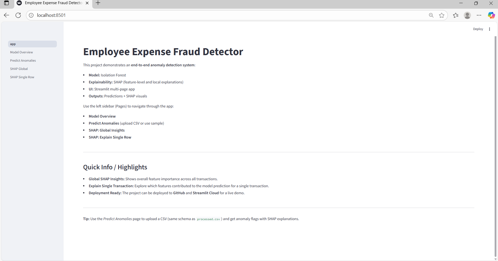
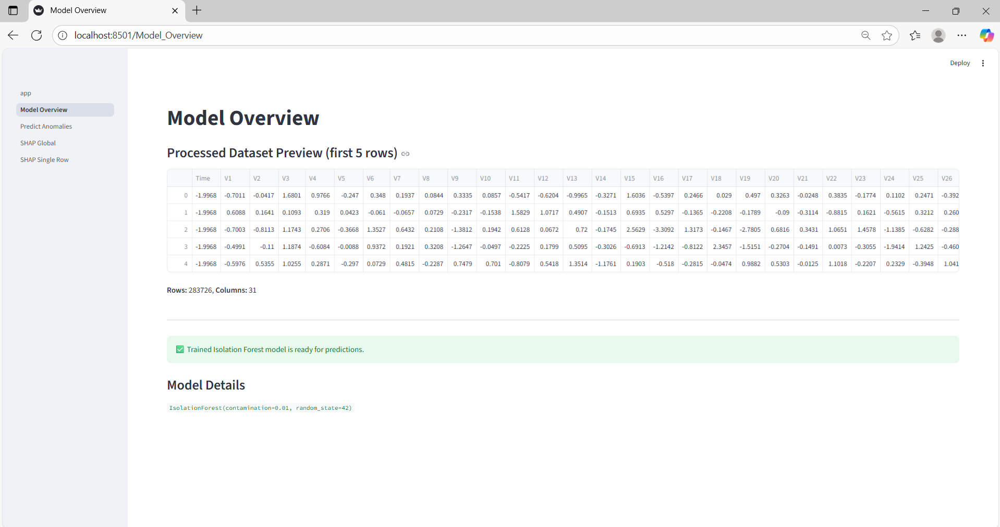
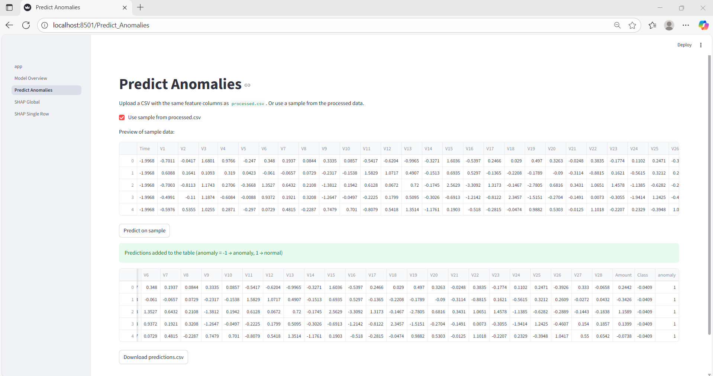
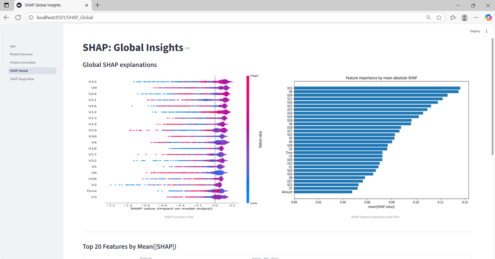
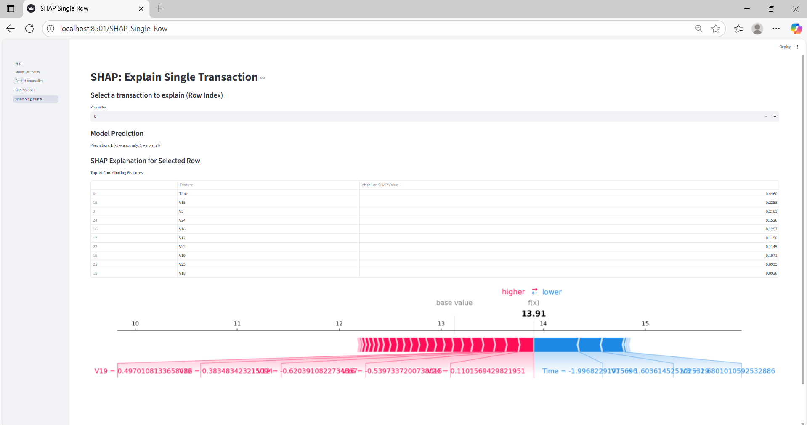

# Employee Expense Fraud Detector  

**End-to-end anomaly detection system to identify fraudulent employee expense transactions using Isolation Forest and SHAP explainability.**

This project helps organizations detect anomalous expense claims and understand the key factors behind anomalies through interactive visualizations:

- **Isolation Forest (IF):** Unsupervised model to detect anomalous transactions  
- **SHAP Explainability (Global + Local):** Understand feature contributions for anomalies  
- **Interactive UI using Streamlit:** Multi-page interface for predictions and visual explanations  
- **Deployment-ready:** Hosted on GitHub and Streamlit Cloud for live demo

---

##  Features

###  1. Predict Anomalous Transactions
- Upload CSV or use sample dataset  
- Model predicts: *Anomaly (-1) / Normal (1)*  
- View SHAP-based contributing factors

###  2. SHAP Global Insights
- Feature importance across entire dataset  
- Helps understand what drives anomalies

###  3. SHAP Local Insights
- Explain a **single row’s** prediction  
- Force plots show positive & negative feature contributions

###  4. Clean & Fast UI
- Sidebar navigation  
- Multi-page Streamlit structure  
- Clear visuals & explanations  

---

##  Project Structure
```text
employee-expense-fraud-detector/
│
├── data/
│   ├── isolation_forest_model.pkl
│   ├── predictions.csv
│   ├── processor.csv
│   ├── raw.csv
│   ├── results/
│   │   ├── shap_bar.png
│   │   ├── shap_feature_importance.csv
│   │   ├── shap_force_example.png
│   │   └── shap_summary.png
│   └── screenshots/
│       ├── home_page.png
│       ├── model_overview.png
│       ├── predict_anomalies.png
│       ├── shap_global.png
│       └── shap_single.png
│
├── src/
│   ├── predict.py
│   ├── preprocess.py
│   ├── shap_explain.py
│   └── train.py
│
├── streamlit_app/
│   ├── pages/
│   │   ├── model_overview.py
│   │   ├── predict_anomalies.py
│   │   ├── shap_global.py
│   │   └── shap_single_row.py
│   ├── app.py
│   └── config.toml
│
├── venv/
├── .gitignore
├── README.md
└── requirements.txt

```
---

## 📸 Screenshots (App Preview)

### 🏠 Home Page  


### 📘 Model Overview  


### 🔍 Predict Anomalies  


### 📊 SHAP Global Importance  


### 🎯 SHAP Single Prediction  


---

##  How to Run Locally

1. Clone the repo:
git clone <your-repo-url>
cd employee-expense-fraud-detector


2. Create a virtual environment:
python -m venv venv

3. Activate the environment:
- Windows: `venv\Scripts\activate`  
- macOS/Linux: `source venv/bin/activate`

4. Install dependencies:
pip install -r requirements.txt

5. Run the app:
streamlit run streamlit_app/app.py


---

##  Requirements / Dependencies

- Python 3.10+  
- Streamlit  
- pandas, numpy, scikit-learn, joblib  
- shap, matplotlib, seaborn, altair, plotly  

(All packages listed in `requirements.txt`)

---

##  Project Status

- Data Preprocessing  
- Isolation Forest Model Training  
- SHAP Global & Local Explanations  
- Streamlit Multi-Page UI  
- Deployed on Streamlit Cloud

---

## Business Impact & Skills Demonstrated

- Detected anomalies in employee expenses, reducing potential financial fraud risk  
- Applied Isolation Forest for unsupervised anomaly detection  
- Used SHAP for global and local explainability  
- Built a clean, interactive Streamlit UI for end-to-end demonstration  
- Hands-on experience with Python ML stack and deployment on Streamlit Cloud


